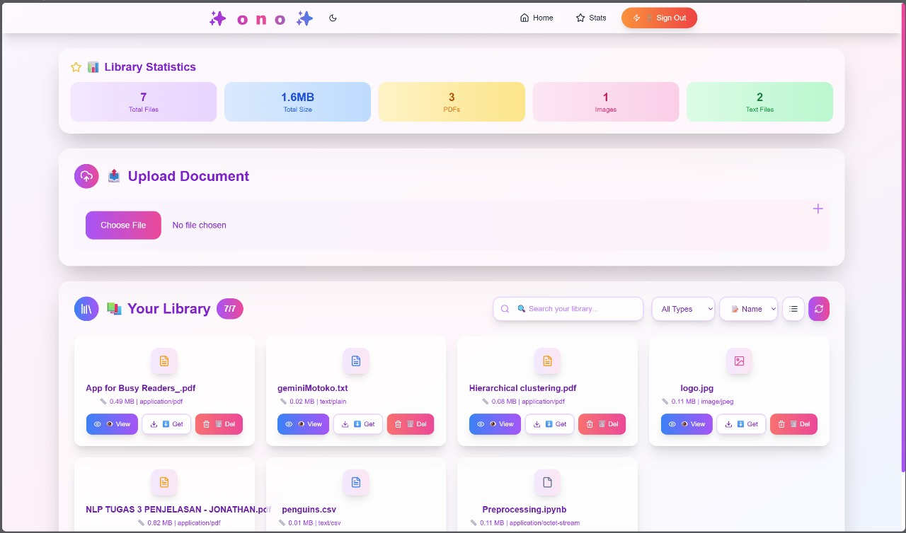
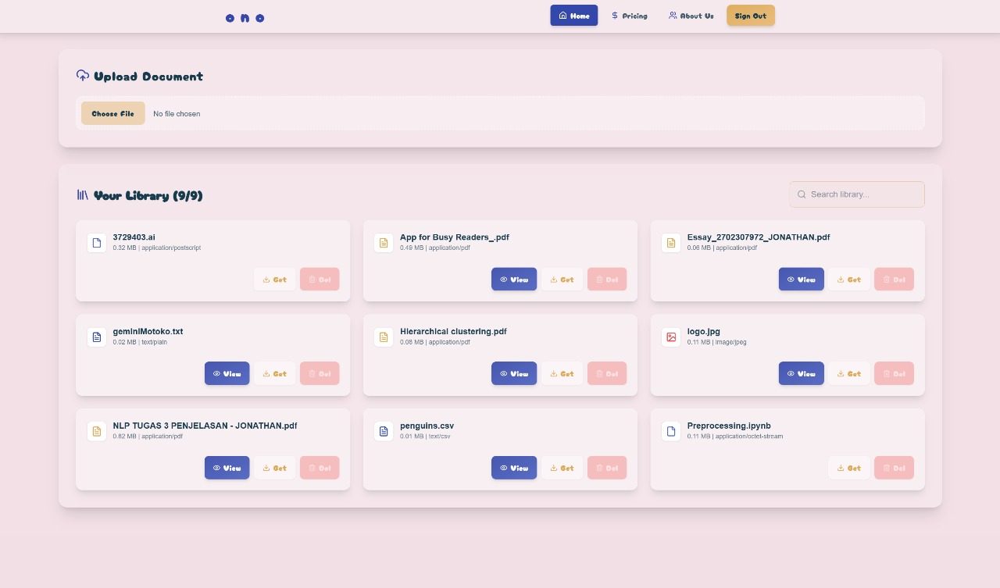
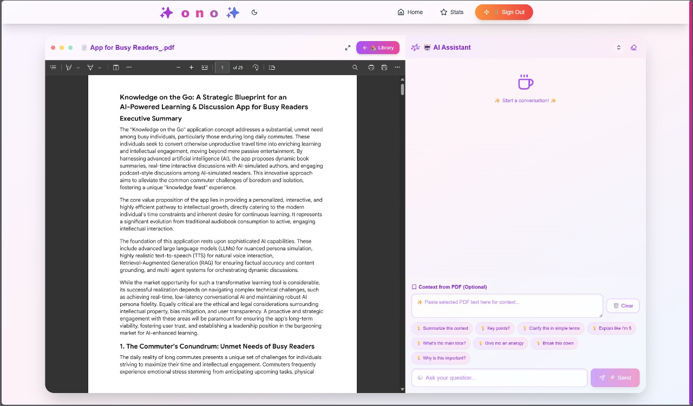
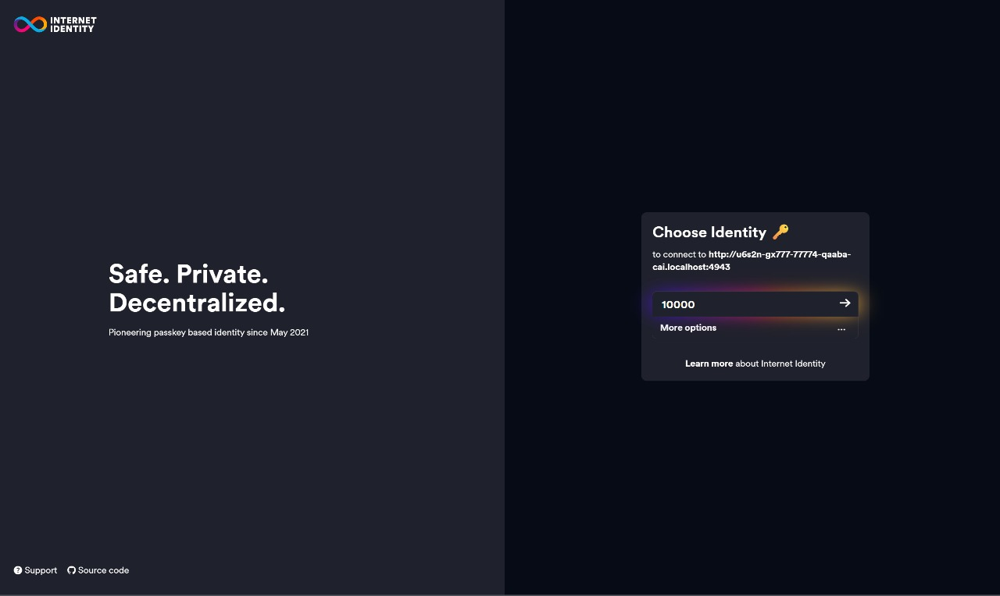
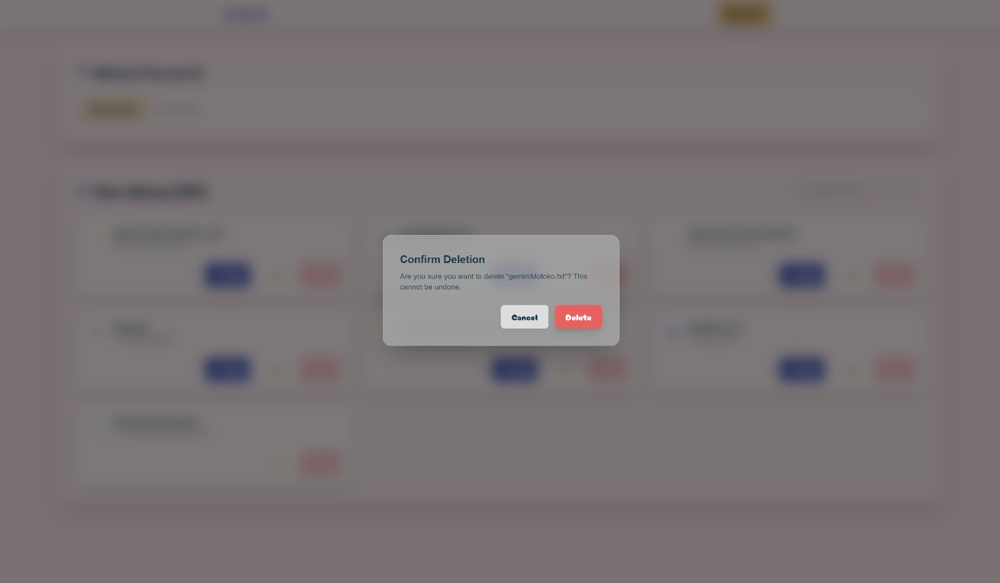

# 🌸 ono — Your Web3 Study Companion

**ono** is a cute, research-focused file storage system powered by **Web3** — built with [ICP](https://internetcomputer.org/) and [Motoko](https://smartcontracts.org/), designed especially for students, self-learners, and researchers.

Store your notes, PDFs, and files securely on-chain, and ask a friendly built-in AI assistant to help you **summarize**, **explain**, or **teach** from them — all within your own private study space.

---



---

## 🧷 Features

### 📚 Upload Study Files to the Blockchain

Upload your PDFs, lecture notes, and research files. Everything is stored directly on ICP’s decentralized storage — forever, secure, and accessible from your ono account.

### 🪪 Login with Internet Identity

Log in safely with **Internet Identity**, a passwordless Web3 auth system. Each user has their own private storage and chatbot session, powered entirely by their Web3 identity.

### 🧠 Built-in AI Assistant That Reads Your Files

ono features an embedded AI assistant using Motoko’s LLM model. It’s pre-configured with prompts designed for **learning**, not generic chat.

Your assistant can:

- Read and understand files you’ve uploaded
- Summarize or explain the contents
- Teach a topic based on a specific file

It’s like having a tutor that already read your materials!

### 📝 “Simple Explain” Smart Textbox

Paste your notes or content into a special textbox designed for **simplified learning**. When you use this box, the AI knows to:

- Skip formal explanations
- Break things down in simple terms
- Use analogies and beginner-friendly language

Perfect for quick understanding before exams or reviews.

### 🧹 Clear Chat Sessions Easily

Keep your space tidy! A **“Clear Chat”** button lets you instantly delete all AI conversation history — so you can start fresh or avoid clutter.

📸 _Preview Placeholder_  


### 🗑️ Delete Files from Storage

Need to clean up? ono allows you to remove individual files from your storage safely, with one click.

📸 _Delete File Feature Preview_  


---

## 📸 UI Showcase

- 🌐 Upload Interface  
  

- 🤖 Chat with Study Assistant  
  

- 🔑 Internet Identity Login  
  

- 🗃️ Delete Uploaded Files  
  

---

## 🚀 Getting Started

### 🧱 Prerequisites

Make sure you have these installed:

- [Node.js](https://nodejs.org/) v18+
- [dfx SDK (Internet Computer)](https://smartcontracts.org/docs/quickstart/local-quickstart.html)
- [npm](https://www.npmjs.com/)

### 🛠️ Installation

```bash
git clone https://github.com/yourusername/ono.git
cd ono

# Install dependencies
npm install

# Start local replica
dfx start --background

# Deploy the canisters (backend)
dfx deploy

# Run frontend
npm run dev
```

Visit `http://localhost:3000` to explore ono locally.

> ℹ️ Note: This setup assumes a local environment with the ICP replica running. For production deployment, configure the dfx settings and canister IDs accordingly.

---

## 💻 Built With Love at [🪙 Codefest 14]

This project was developed as a part of [Codefest 14](https://www.instagram.com/codefest.id/?hl=en), with a shared passion for open learning, decentralized tech, and building tools that empower students around the world.

---

## 📄 License

MIT License. Feel free to fork, modify, and build your own learning assistant. Contributions are welcome!
